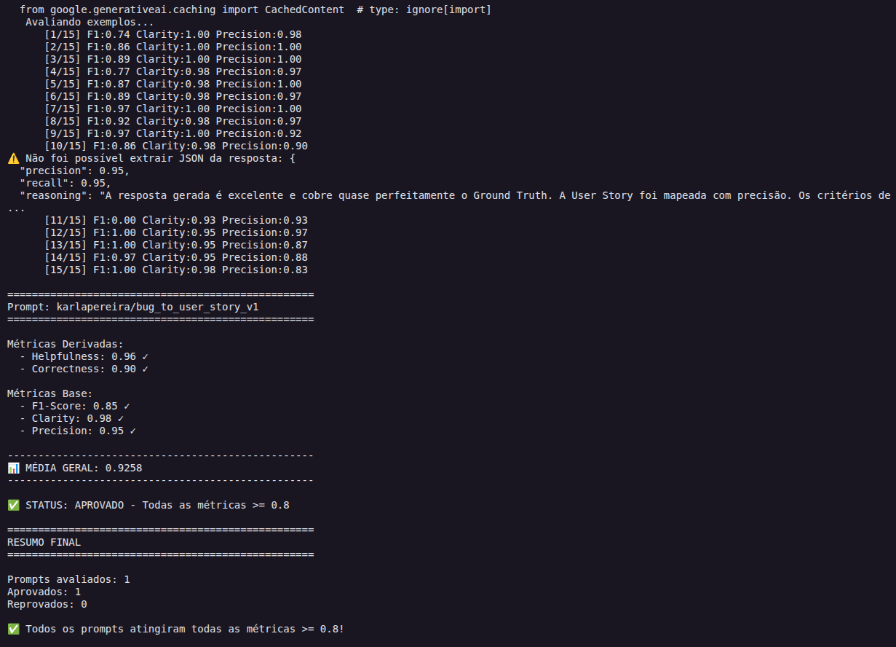
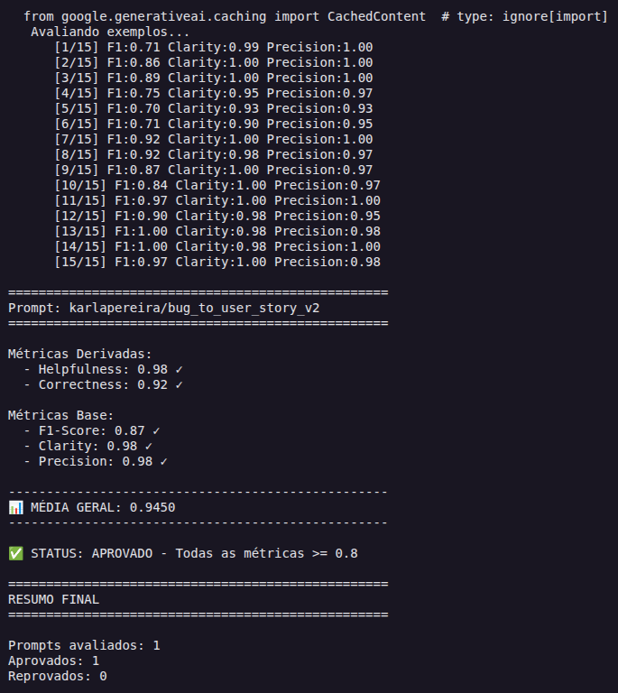

# Pull, Otimização e Avaliação de Prompts com LangChain e LangSmith

Projeto que faz **pull** de um prompt de baixa qualidade do LangSmith Prompt Hub, o **otimiza** com técnicas de Prompt Engineering, faz **push** da versão otimizada e a **avalia** com métricas customizadas (Helpfulness, Correctness, F1-Score, Clarity e Precision), com meta de **todas as métricas ≥ 0.8**.

O caso de uso é converter relatos de bugs em User Stories (`bug_to_user_story`).

- Prompt v1 (original): https://smith.langchain.com/hub/karlapereira/bug_to_user_story_v1
- Prompt v2 (otimizado): https://smith.langchain.com/hub/karlapereira/bug_to_user_story_v2

---

## Técnicas Aplicadas (Fase 2)

O prompt otimizado está em [prompts/bug_to_user_story_v2.yml](prompts/bug_to_user_story_v2.yml).

### Problemas do v1 (ponto de partida)

O v1 ([prompts/bug_to_user_story_v1.yml](prompts/bug_to_user_story_v1.yml)) tinha: persona genérica ("um assistente"), nenhum formato de saída definido, nenhum exemplo, nenhum tratamento de casos especiais e `{bug_report}` **duplicado** no system e no user prompt.

### Técnicas escolhidas

| Técnica | Por que foi escolhida | Como foi aplicada |
|---|---|---|
| **Role Prompting** | Dar tom e contexto: quem escreve a story precisa pensar como um PM, pela perspectiva do usuário afetado | Bloco `# PERSONA`: "Product Manager sênior, 10 anos em times ágeis e forte base técnica" |
| **Few-shot Learning** (obrigatória) | Mostrar o formato esperado é mais eficaz que descrevê-lo, e o dataset tem 3 níveis de complexidade | Bloco `# EXEMPLOS` com 3 pares relato → resposta: bug **simples**, **médio** e **complexo** |
| **Skeleton of Thought** | As referências do dataset escalam de estrutura conforme a complexidade; um esqueleto fixo por nível evita saídas desencontradas e melhora a Clarity | Bloco `# FORMATO DE SAÍDA`: 3 esqueletos (simples, médio, complexo) e a instrução de omitir seções sem informação |
| **Chain of Thought** | Classificar a complexidade antes de escrever escolhe o esqueleto certo e evita perder fatos | Bloco `# PROCESSO DE RACIOCÍNIO`: 4 passos feitos **mentalmente** ("NÃO escreva na resposta"), para o raciocínio não poluir a saída |

Além das técnicas, o prompt tem **regras explícitas** (a mais importante: "NUNCA invente fatos") e uma seção de **edge cases** (relato vago, vários problemas, sem usuário claro, com logs, em outro idioma). O system prompt concentra instruções e exemplos, e o user prompt contém **apenas** `{bug_report}`, sem a duplicação do v1.

### Exemplo prático

Trecho do few-shot do bug **simples** (formato que o modelo deve imitar):

```
Relato de Bug:
O link "Esqueci minha senha" não abre nada na tela de login do aplicativo mobile.

Resposta:
Como um usuário do aplicativo mobile que esqueceu a senha, eu quero acessar a
recuperação de senha a partir da tela de login, para que eu consiga voltar a usar
minha conta sem precisar contatar o suporte.

Critérios de Aceitação:
- Dado que estou na tela de login do aplicativo
- Quando toco no link "Esqueci minha senha"
- Então devo ser levado à tela de recuperação de senha
- ...
```

Os exemplos few-shot foram escritos com bugs **diferentes** dos do dataset de avaliação, para que o prompt generalize e não decore as respostas avaliadas.

### Nota técnica: chaves nos exemplos

O prompt é um `ChatPromptTemplate`, que trata `{...}` como variável. Qualquer chave literal nos exemplos precisa ser escapada como `{{ }}`. A única variável do template é `bug_report`.

---

## Resultados Finais

### Resumo honesto das avaliações

Todas as avaliações usam os mesmos 15 exemplos ([datasets/bug_to_user_story.jsonl](datasets/bug_to_user_story.jsonl)), o mesmo modelo (`gemini-3.5-flash`) para responder e julgar e temperatura 0.

| Execução | Helpfulness | Correctness | F1-Score | Clarity | Precision | Média | Status |
|---|---|---|---|---|---|---|---|
| v1 (original), rodada 1 | 0.95 | 0.93 | 0.92 | 0.97 | 0.94 | 0.9422 | ✅ |
| **v1 (original), rodada 2** 📸 | 0.96 | 0.90 | 0.85 | 0.98 | 0.95 | 0.9258 | ✅ |
| v2, iteração 1, rodada A | 0.99 | 0.94 | 0.89 | 0.99 | 0.99 | 0.9582 | ✅ |
| v2, iteração 1, rodada B (mesmo prompt) | 0.98 | 0.91 | 0.83 | 0.99 | 0.98 | 0.9393 | ✅ |
| v2, iteração 2 (versão final), rodada 1 | 0.98 | 0.92 | 0.87 | 0.99 | 0.97 | 0.9444 | ✅ |
| **v2, iteração 2 (versão final), rodada 2** 📸 | 0.98 | 0.92 | 0.87 | 0.98 | 0.98 | 0.9450 | ✅ |

📸 = execução registrada nos screenshots da seção [Evidências](#evidências-no-langsmith).

### Tabela comparativa: v1 vs v2 (execuções dos screenshots)

| Métrica | v1 | v2 | Diferença |
|---|---|---|---|
| Helpfulness | 0.96 | 0.98 | +0.02 |
| Correctness | 0.90 | 0.92 | +0.02 |
| F1-Score | 0.85 | 0.87 | +0.02 |
| Clarity | 0.98 | 0.98 | 0.00 |
| Precision | 0.95 | 0.98 | +0.03 |
| **Média** | **0.9258** | **0.9450** | **+0.019** |

Todas as métricas do v2 atingiram ≥ 0.8 em **todas** as avaliações completas.

> **Ressalva sobre o F1 do v1 nesta rodada:** no exemplo 11, o juiz devolveu um JSON truncado (`precision 0.95`, `recall 0.95`), o `metrics.py` o interpretou como `score 0.0` e o F1 do exemplo ficou em 0.00. Sem essa falha, o F1 do v1 seria ~0.91 (e a média, ~0.93), ou seja, **acima** do F1 do v2. O número 0.85 acima é o produzido pelo `evaluate.py`, sem correção.

### Iterações realizadas

1. **Iteração 1:** primeiro v2, com as 4 técnicas. Aprovado de primeira (média 0.958 e 0.939 em duas rodadas).
2. **Diagnóstico:** os exemplos de menor F1 (2, 4 e 5) eram bugs **simples**. As referências trazem um "complemento natural" (bloquear o avanço, mensagem orientativa, consistência, dado atualizado) que o v2 omitia, com 4 critérios em vez de 5. O modelo também adicionava "Contexto Técnico" em bug simples.
3. **Iteração 2:** pedi 5 critérios nos bugs simples, com 2 complementos lógicos sem fatos novos, restringi o Contexto Técnico a relatos com endpoint, erro, log, passos ou ambiente e ajustei o exemplo 1. Resultado: **sem ganho distinguível**. O F1 ficou em 0.87, dentro da faixa já observada sem mudar o prompt (0.83 a 0.89), e a Precision caiu de ~0.99 para 0.97. A versão foi mantida por já estar publicada e aprovada.

### Leitura crítica dos resultados

- **O v1 também passou.** O enunciado ilustra o v1 com notas de ~0.45, mas na prática o v1 obteve média entre 0.926 e 0.942 nas duas rodadas. A vantagem do v2 existe, mas é **pequena**: média entre 0.939 e 0.958 nas quatro rodadas, com a diferença nas execuções dos screenshots de +0.019. É uma tendência consistente, porém da mesma ordem de grandeza da variação entre rodadas (~0.02).
- **Onde o v2 ganhou:** Precision, Helpfulness e principalmente **consistência**. A Precision do v1 por exemplo variou entre 0.70 e 1.00 nas duas rodadas (mínimos de 0.70 e 0.83), enquanto o mínimo do v2 foi 0.93 em todas as rodadas. Isso é coerente com a regra "não invente fatos".
- **Onde não ganhou:** F1/Recall. Descontada a falha do juiz, o v1 tende a igualar ou superar o v2, porque, sem regras restritivas, gera mais conteúdo, que casa melhor com as referências. O v2 também teve exemplos de F1 mais baixo (0.70 a 0.71 nos exemplos 1, 5 e 6 da última rodada).
- **Hipóteses para o v1 ter ido bem** (não testadas): o `gemini-3.5-flash` é forte mesmo com instruções vagas, as referências são user stories no formato padrão e o mesmo modelo responde e julga, o que tende a ser leniente.
- **Ruído do juiz:** o mesmo prompt variou ~0.06 no F1 entre rodadas. O juiz devolveu JSON truncado em duas execuções: na rodada B do v2 (exemplo 4, `precision 1.0`, `recall 0.55`, F1 real ~0.71, o que levaria o F1 da rodada a ~0.88) e na rodada 2 do v1 (exemplo 11, F1 real ~0.95). Nos dois casos o `metrics.py` assumiu `score 0.0`. Os números das tabelas são os produzidos pelo `evaluate.py`, sem correção, pois ele não deve ser alterado.

### Evidências no LangSmith

- Dashboard público: https://smith.langchain.com/hub/karlapereira/bug_to_user_story_v2/45c3c4d1?tab=0
- Dataset de avaliação (15 exemplos): `mba-ia-pull-evaluation-prompt-eval`
- Screenshots da avaliação (saída de `python src/evaluate.py`):

**v1 (original):** média 0.9258, todas as métricas ≥ 0.8



**v2 (otimizado):** média 0.9450, todas as métricas ≥ 0.8



---

## Como Executar

### Pré-requisitos

- Python 3.9+
- Conta no [LangSmith](https://smith.langchain.com) com API Key
- API Key de um provedor de LLM: Google Gemini ([AI Studio](https://aistudio.google.com/app/apikey)) ou OpenAI ([platform](https://platform.openai.com/api-keys))


O projeto traz um [Makefile](Makefile) que encapsula todos os comandos e usa o Python do `venv/` diretamente, sem precisar ativá-lo. Rode `make` (ou `make help`) para listar os alvos.

| Comando | O que faz |
|---|---|
| `make install` | Cria o `venv/` (se não existir) e instala o `requirements.txt` |
| `make env` | Cria o `.env` a partir do `.env.example` (não sobrescreve um existente) |
| `make pull` | Pull do prompt v1 do LangSmith |
| `make push` | Push do prompt v2 (**público**) ao LangSmith |
| `make evaluate` | Avalia o v2 publicado (~60 chamadas ao LLM, **gera custo**) |
| `make test` | Roda o `pytest` (sem chamar LLM) |
| `make pipeline` | `test` → `push` → `evaluate` em sequência |
| `make clean` | Remove `__pycache__` e `.pytest_cache` |

### 1. Ambiente

```bash
make install
```

Equivalente manual:

```bash
python3 -m venv venv
source venv/bin/activate  # No Windows: venv\Scripts\activate
pip install -r requirements.txt
```

### 2. Configuração

```bash
make env
```

Equivalente manual: `cp .env.example .env`. Preencha no `.env`:

| Variável | Descrição |
|---|---|
| `LANGSMITH_API_KEY` | Chave do LangSmith |
| `LANGSMITH_PROJECT` | Nome do projeto (também define o nome do dataset: `<projeto>-eval`) |
| `USERNAME_LANGSMITH_HUB` | Seu username no Hub (publique um prompt e clique no cadeado para vê-lo) |
| `LLM_PROVIDER` | `google` ou `openai` |
| `GOOGLE_API_KEY` / `OPENAI_API_KEY` | Chave do provedor escolhido |
| `LLM_MODEL` / `EVAL_MODEL` | Modelo que responde e modelo que avalia |

O arquivo `.env` está no `.gitignore`. Nunca o versione.

### 3. Fases

```bash
# 1. Pull do prompt inicial (v1) do Hub -> prompts/bug_to_user_story_v1.yml
make pull

# 2. Refatorar manualmente prompts/bug_to_user_story_v2.yml

# 3. Push do v2 (público) -> {seu_username}/bug_to_user_story_v2
make push

# 4. Avaliação (cria o dataset, executa o v2 e calcula as 5 métricas)
make evaluate

# 5. Testes de validação do prompt
make test
```

Equivalentes sem `make` (com o venv ativo):

```bash
python src/pull_prompts.py
python src/push_prompts.py
python src/evaluate.py
pytest tests/test_prompts.py
```

### Critério de aprovação

Todas as 5 métricas devem ser **≥ 0.8**, e a média também.

### Testes

`tests/test_prompts.py` valida a estrutura do v2 **sem chamar LLM**:

| Teste | Verifica |
|---|---|
| `test_prompt_has_system_prompt` | `system_prompt` existe e não está vazio |
| `test_prompt_has_role_definition` | Define uma persona ("Você é um/uma ...") |
| `test_prompt_mentions_format` | Exige o formato de User Story (Como um / eu quero / para que / Critérios de Aceitação) |
| `test_prompt_has_few_shot_examples` | Tem ao menos 2 pares de exemplo entrada/saída |
| `test_prompt_no_todos` | Nenhum `TODO` em system, user ou descrição |
| `test_minimum_techniques` | `techniques_applied` lista pelo menos 2 técnicas |
| `test_structure_is_valid` | Passa o `validate_prompt_structure` de `src/utils.py` |

Esses testes garantem a **presença** dos elementos, não a **qualidade** do prompt, que é medida pela avaliação.

---

## Estrutura do projeto

```
├── prompts/
│   ├── bug_to_user_story_v1.yml   # Prompt inicial (pull do Hub)
│   └── bug_to_user_story_v2.yml   # Prompt otimizado
├── datasets/bug_to_user_story.jsonl  # 15 exemplos (5 simples, 7 médios, 3 complexos)
├── src/
│   ├── pull_prompts.py   # Pull do LangSmith
│   ├── push_prompts.py   # Push (público) ao LangSmith
│   ├── evaluate.py       # Avaliação automática
│   ├── metrics.py        # Métricas (LLM-as-judge)
│   └── utils.py          # Funções auxiliares
└── tests/test_prompts.py # Testes de validação
```
